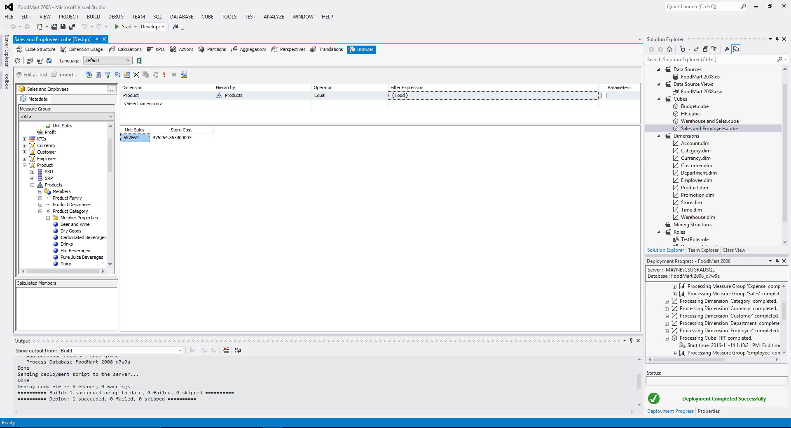
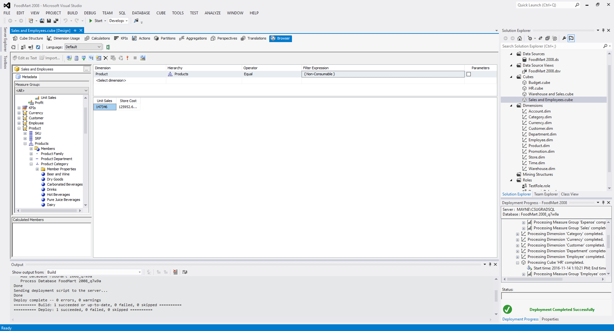
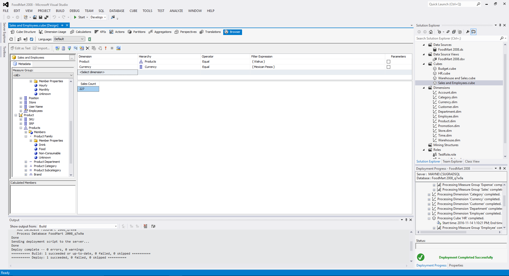

# CPSC 304 - Tutorial 9 Data Warehousing
Tristan Rice, q7w9a, 25886145

## Exercise 1

Being able to drill down into a hierarchy allows for invesitgating datasets at
both the high level, and the low level. You can focus in on specific areas of
interest.

Being able to roll up, is also important in case someone goes too deep, or
realizes they want to see related areas. For instance, someone interested in
weekend sales may later realize that weekday sales provide an important
reference.

## Exercise 2
### 1) For this product, what is the grand total of unit sales?o

426 Unit Sales

### 2)
#### (a) Which day has the highest number of sales for that product?

Sunday has the highest number of sales with 91.

#### (b) Are the sales evenly distributed? Explain.

No, the sales are not evenly distributed. Some days have many more sales than
others.

### 3) Why would a business want to track the total number of unit sales on a particular day?

It could be useful for businesses to know exactly how many are sold on each day
to predict consumption numbers in the future and when to restock areas.

### 4) Why would a business want to identify any outliers (anomalies)? Provide some examples of what a manager might do with this information.

Identifying outliers can identify important trends. If there's always a high
sale rate on Sunday, a manager could ensure that there's plenty of a certain
item in stock.

## Exercise 3

MDX is a way of programatically returning results that you would want from the
Data Cube in Step 4. This allows you to get the same type of aggregation results
across multiple rows and columns.

## Exercise 4

\

\

\

## Exercise 5

\

This query finds the number of "Walrus" products that have been bought using
Mexican Pesos. These results could be useful for determining the demographic of
those purchasing the products.

